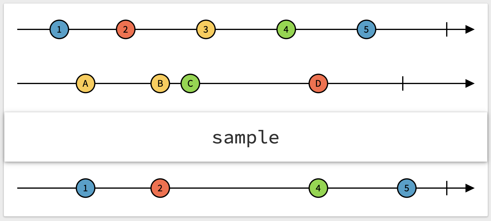

# SampledPublisher

The SampledPublisher samples the output of a publisher based on events from another
publisher.

## Usage 

This example shows how to sample the value from a "temperature publisher" every
60 seconds. 
The temperature sensor may send many values while the timer sends one value
exectly every 60 seconds. By sampling the timer, the resulting Publisher
emits the most recent temperature measurement every 60 seconds.

Note that a value is not sampled twice. 

If the temperature sensor does not emit a value during for a complete minute,
no value is send by the sampled publisher.

```swift
    let timer = Timer.publish(every: 60, on: RunLoop.main, in: .default)
    temperature
        .sample(timer)
        .sink { temperature in print("The temperature is \(temperature)" }
```

## Demo

[rxmarbles/sample](https://rxmarbles.com/#sample)


## Installation

### Package.swift

Edit the Package.swift file. Add the SampledPublisher as a dependency:
 
```
let package = Package(
    name: " ... ",
    products: [ ... ],
    dependencies: [
        .package(url: "https://github.com/berikv/SampledPublisher.git", from: "1.0.0") // here
    ],
    targets: [
        .target(
            name: " ... ",
            dependencies: [
                "SampledPublisher" // and here
            ]),
    ]
)
```

### For .xcodeproj projects

1. Open menu File > Add Packages...
2. Search for "https://github.com/berikv/SampledPublisher.git" and click Add Package.
3. Open your project file, select your target in "Targets".
4. Open Dependencies
5. Click the + sign
6. Add SampledPublisher

